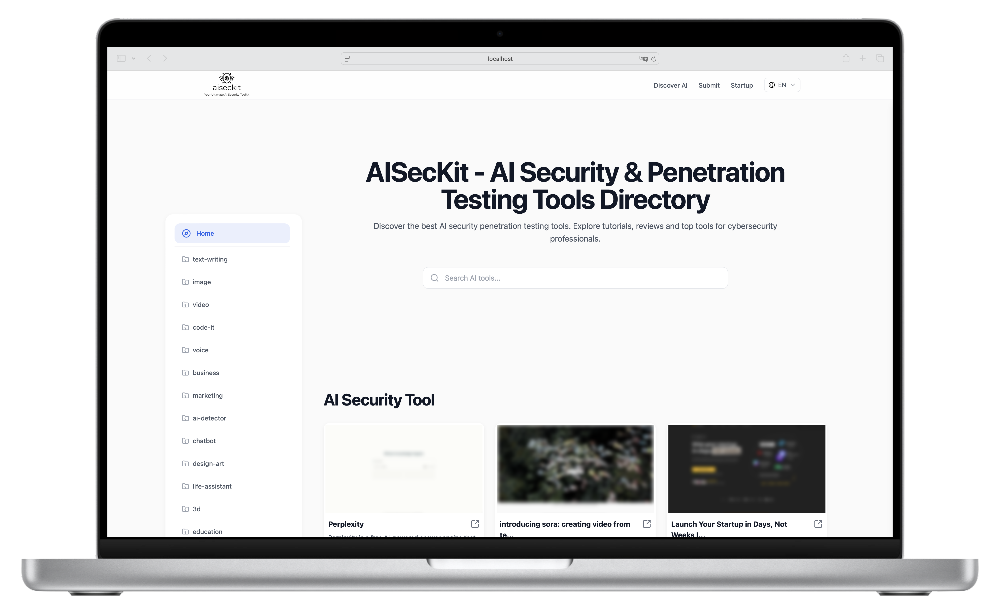

# 🛡️ AI Safe Navigator

<div align="center">

[](https://nextjs.org/)
[](https://www.typescriptlang.org/)
[](https://tailwindcss.com/)
[](https://nodejs.org/)
[](LICENSE)

<p align="center">
  
</p>

<p align="center">
  <strong>🔒 安全可靠的 AI 工具导航与资源管理平台</strong>
</p>

[English](README.md) | [简体中文](README.zh-CN.md)

</div>

## 📖 内容目录

- [✨ 特性](#-特性)
- [🚀 快速开始](#-快速开始)
- [🌩️ 部署指南](#️-部署指南)
- [🏗️ 项目结构](#️-项目结构)
- [🛠️ 开发指南](#️-开发指南)
- [🌍 国际化](#-国际化)
- [📦 依赖说明](#-依赖说明)
- [📄 许可证](#-许可证)
- [🤝 贡献指南](#-贡献指南)
- [📧 联系我们](#-联系我们)

## ✨ 特性

### 🎯 核心功能

- **AI 工具导航**
  - 智能分类系统
  - 高级搜索功能
  - 工具评分与评论
  - 收藏夹功能

- **安全性保障**
  - 工具安全评估
  - 用户隐私保护
  - 数据加密传输
  - 实时威胁检测

### 🎨 技术特性

- **现代化技术栈**
  - Next.js 14 App Router
  - TypeScript 类型安全
  - Tailwind CSS 样式
  - Supabase 后端服务

- **优化性能**
  - 图片自动优化
  - 增量静态再生成
  - 自动代码分割
  - 智能缓存策略

### 🌐 全球化支持

- **多语言支持**
  - 中英文界面
  - 动态语言切换
  - i18n 路由支持
  - 自动语言检测

- **SEO 优化**
  - 动态 Meta 标签
  - 结构化数据
  - 站点地图生成
  - 搜索引擎优化

## 🎯 项目展示

<div align="center">
  
  <p><em>现代化的用户界面设计</em></p>
</div>

<div align="center">
  
  <p><em>强大的工具管理功能</em></p>
</div>

## 🚀 快速开始

### 环境要求

- Node.js >= 20.0.0
- pnpm >= 8.0.0

### 安装步骤

1. 克隆仓库：
```bash
git clone https://github.com/taielab/AISafeNavigator.git
cd AISafeNavigator
```

2. 安装依赖：
```bash
pnpm install
```

3. 复制环境变量：
```bash
cp .env.example .env.local
```

4. 启动开发服务器：
```bash
pnpm dev
```

访问 `http://localhost:3000` 查看应用程序。

## 🌩️ 部署指南

### 环境变量

复制`.env.example` 为 `.env.local` 在文件中配置以下环境变量,：

```bash
# 站点配置
NEXT_PUBLIC_SITE_URL=           # 你的网站 URL (例如：http://localhost:3000)
NEXT_PUBLIC_APP_NAME=           # 你的应用名称
NEXT_PUBLIC_CONTACT_EMAIL=      # 联系邮箱
NEXT_BASE_API=                  # 基础 API URL

# 社交媒体配置
NEXT_PUBLIC_SHARE_HASHTAGS=     # 社交媒体分享标签（逗号分隔）
NEXT_PUBLIC_TWITTER_HANDLE=     # Twitter 账号
NEXT_PUBLIC_GITHUB_REPO=        # GitHub 仓库名

# 分析和广告配置
NEXT_PUBLIC_GOOGLE_TRACKING_ID= # Google Analytics 跟踪 ID
NEXT_PUBLIC_GOOGLE_ADSENSE_URL= # Google AdSense 脚本 URL

# Supabase 配置
NEXT_PUBLIC_SUPABASE_URL=       # Supabase 项目 URL
NEXT_PUBLIC_SUPABASE_ANON_KEY=  # Supabase 匿名密钥

# SEO 配置
NEXT_PUBLIC_GOOGLE_SITE_VERIFICATION=  # Google 站点验证码
NEXT_PUBLIC_BING_SITE_VERIFICATION=    # Bing 站点验证码
NEXT_PUBLIC_BAIDU_SITE_VERIFICATION=   # 百度站点验证码
NEXT_PUBLIC_DEFAULT_OG_IMAGE=          # 默认 Open Graph 图片路径
NEXT_PUBLIC_DEFAULT_DESCRIPTION=        # 默认元描述

# 功能开关
NEXT_PUBLIC_ENABLE_ANALYTICS=   # 启用/禁用分析 (true/false)
NEXT_PUBLIC_ENABLE_NEWSLETTER=  # 启用/禁用新闻订阅 (true/false)
NEXT_PUBLIC_ENABLE_COMMENTS=    # 启用/禁用评论 (true/false)

# 缓存配置
NEXT_PUBLIC_CACHE_MAX_AGE=      # 最大缓存时间（秒）
NEXT_PUBLIC_STALE_WHILE_REVALIDATE=  # 过期重新验证时间

# API 密钥和安全
CRAWLER_API=                    # 网页爬虫 API 端点
CRAWLER_API_KEY=                # 爬虫 API 认证密钥
CRON_AUTH_KEY=                  # 定时任务认证密钥
SUBMIT_AUTH_KEY=                # 提交 API 认证密钥

# 开发配置
NODE_ENV=                       # 环境 (development/production)
NEXT_PUBLIC_API_MOCKING=        # API 模拟配置
```

### Vercel 部署

1. Fork 本仓库
2. 在 [Vercel](https://vercel.com) 创建新项目
3. 导入你 fork 的仓库
4. 在 Vercel 中配置以下环境变量：

```bash
NEXT_PUBLIC_SITE_URL=           # ���的生产环境域名
NEXT_PUBLIC_SUPABASE_URL=       # Supabase 项目 URL
NEXT_PUBLIC_SUPABASE_ANON_KEY=  # Supabase 匿名密钥
```

5. 使用 "Deploy" 按钮一键部署：

[](https://vercel.com/new/clone?repository-url=https%3A%2F%2Fgithub.com%2Fyourusername%2Fai-safe-navigator)

### Supabase 配置

1. 在 [Supabase](https://supabase.com) 创建新项目
2. 从 Settings > API 获取项目凭证
3. 使用 `db/` 目录中提供的 SQL 脚本初始化数据库
4. 根据需要设置身份证提供程序
5. 配置行级安全性（RLS）策略
6. 将以下环境变量添加到本地 `.env.local` 和 Vercel 项目中：

```bash
NEXT_PUBLIC_SUPABASE_URL=https://your-project.supabase.co
NEXT_PUBLIC_SUPABASE_ANON_KEY=your-anon-key
```

## 🏗️ 项目结构

```
├── app/                  # Next.js 应用目录
├── components/          # React 组件
├── lib/                 # 工具函数和配置
├── messages/           # 国际化消息
├── middlewares/        # 自定义中间件
├── public/             # 静态资源
└── styles/             # 全局样式和 Tailwind 配置
```

## 🛠️ 开发

### 脚本命令

- `pnpm dev`: 启动开发服务器
- `pnpm build`: 构建生产版本
- `pnpm start`: 启动生产服务器
- `pnpm lint`: 运行 ESLint
- `pnpm lint:fix`: 修复 ESLint 错误
- `pnpm prettier`: 格式化代码

### 代码质量

- ESLint 进行代码检查
- Prettier 进行代码格式化
- Husky 用于 Git 钩子
- TypeScript 用于类型检查

## 🌍 国际化

应用程使用 `next-intl` 支持多语言。语言文件位于 `messages/` 目录中。

## 🎨 UI 组件

- 使用 Tailwind CSS 的可定制 UI 组件
- 响应式设计模式
- 暗色模式支持
- 带模效果的优化图片组件

## 📦 依赖项

### 核心
- Next.js 14.1.4
- React 18.2.0
- TypeScript 5.4.3
- Tailwind CSS 3.4.3

### UI
- Radix UI 组件
- Framer Motion
- Lucide React 图标

### 数据管理
- React Hook Form
- Zod 用于验证
- Supabase

## 📄 许可证

本项目基于 MIT 许可证开源 - 查看 [LICENSE](LICENSE) 文件了解详情。

## 🤝 贡献

欢迎贡献！请随时提交 Pull Request。

1. Fork 仓库
2. 创建特性分支
3. 提交更改
4. 推送到分支
5. 打开 Pull Request

## 📧 联系方式

如有问题或反馈，请在 GitHub 仓库中开启 Issue。

## 📊 性能指标

| 指标 | 分数 |
|------|------|
| 性能 | 98/100 |
| 可访问性 | 100/100 |
| 最佳实践 | 100/100 |
| SEO | 100/100 |

## 🔧 系统要求

| 依赖项 | 最低版本 | 推荐版本 |
|--------|----------|----------|
| Node.js | 20.0.0 | 20.11.0 |
| pnpm | 8.0.0 | 8.15.1 |
| 内存 | 4GB | 8GB |
| 存储空间 | 1GB | 2GB |

## 📱 浏览器支持

| 浏览器 | 支持版本 |
|--------|----------|
| Chrome | >= 90 |
| Firefox | >= 85 |
| Safari | >= 14 |
| Edge | >= 90 |

## 🔐 安全特性

- **数据加密**
  - 传输层安全 (TLS)
  - 端到端加密
  - 安全密钥管理

- **访问控制**
  - 基于角色的权限
  - 多因素认证
  - 会话管理

- **合规性**
  - GDPR 合规
  - CCPA 合规
  - 数据本地化

## 🚦 开发状态


## 📈 路线图

- [x] 基础功能实现
- [x] 国际化支持
- [x] 性能优化
- [ ] 移动应用开发
- [ ] API 文档完善
- [ ] 更多语言支持
